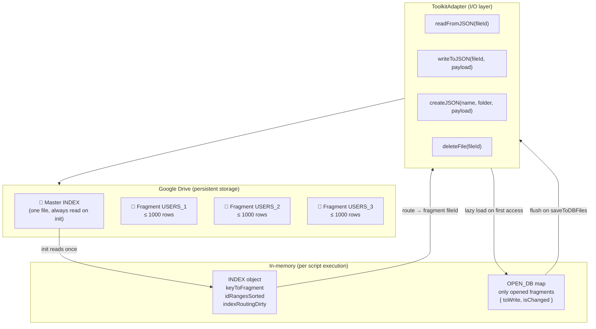
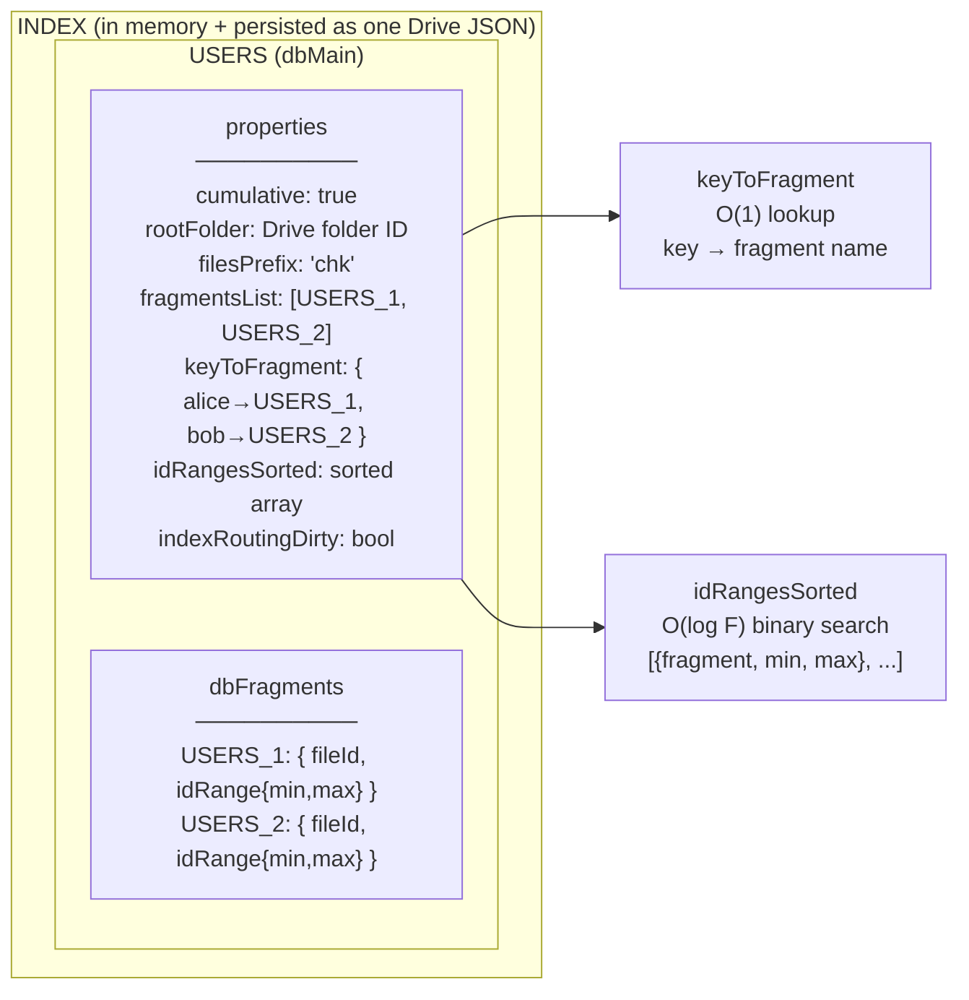
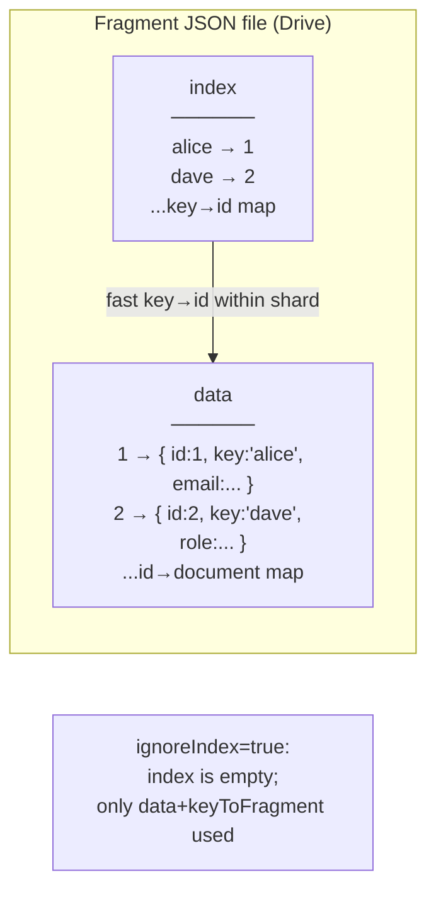
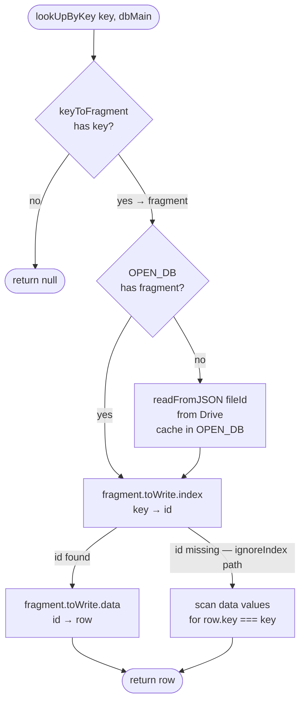
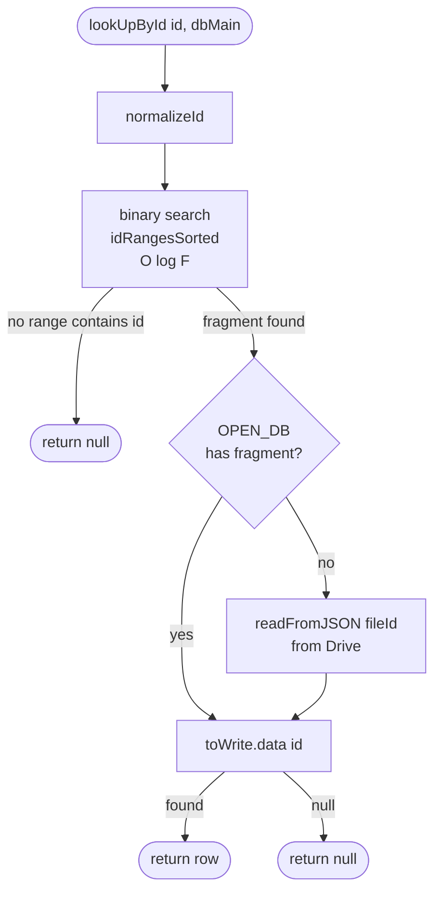
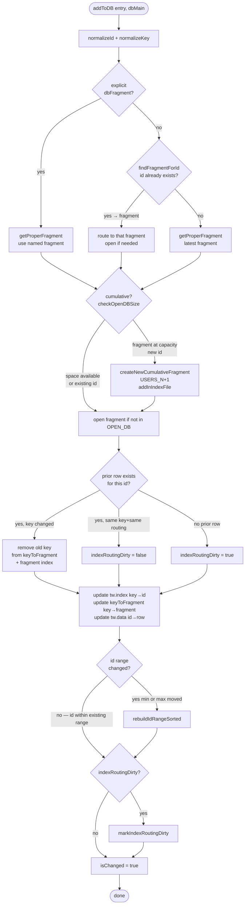
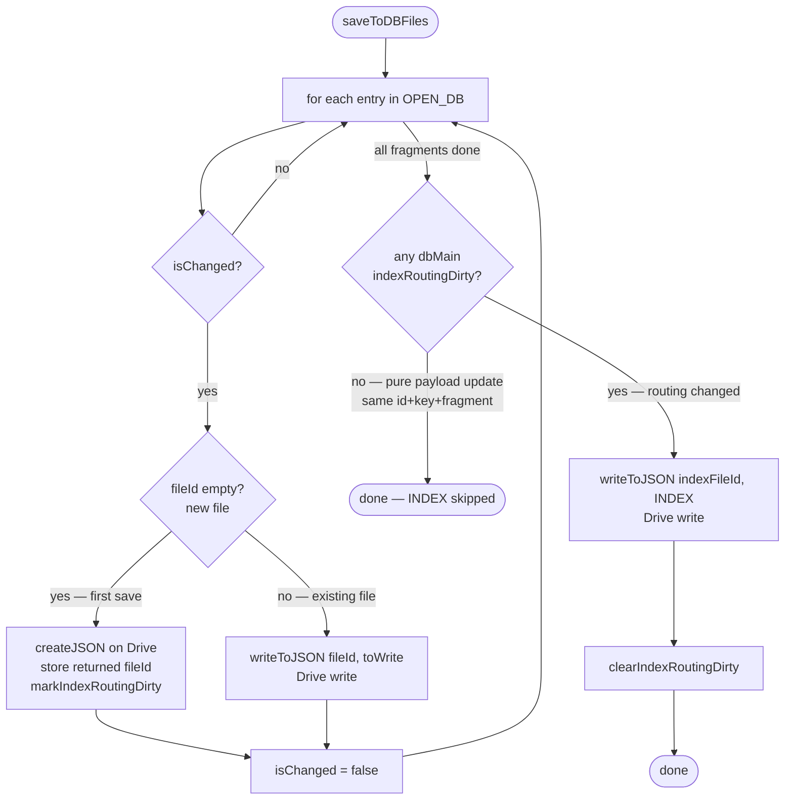
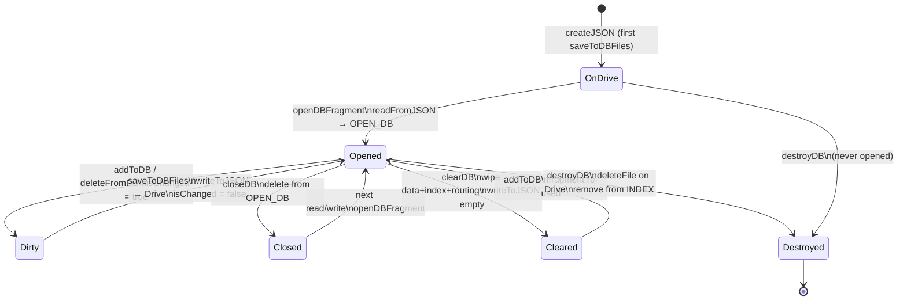
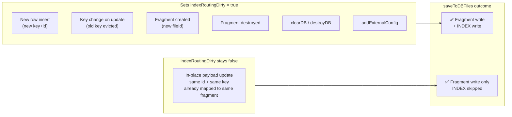
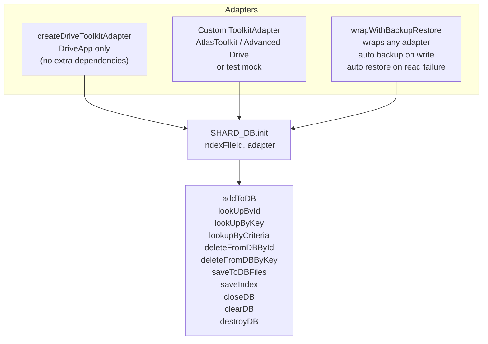

# ShardDB — Architecture & Flow Reference

## What it is

ShardDB is a shard-aware JSON document database layered over Google Drive. Each "table" (`dbMain`) splits its rows across multiple fragment files on Drive. A single master INDEX file holds all routing metadata so reads never need to scan every shard.

---

## 1. System Overview

---

## 2. Master INDEX Structure

---

## 3. Fragment File Structure

---

## 4. Lookup by Key

---

## 5. Lookup by ID

---

## 6. addToDB Flow

---

## 7. saveToDBFiles Flow

---

## 8. Fragment Lifecycle

---

## 9. indexRoutingDirty Decision

This flag is the key to avoiding redundant INDEX writes. The INDEX is only re-written to Drive when routing metadata actually changed.

---

## 10. Adapter Layer

---

## Performance Characteristics

| Operation | Complexity | Notes |
|---|---|---|
| `lookUpByKey` | O(1) | `keyToFragment` map lookup → fragment open if needed |
| `lookUpById` | O(log F) | Binary search on `idRangesSorted`, F = fragment count |
| `addToDB` new row | O(log F) | Route + range check; `rebuildIdRangeSorted` only if range changed |
| `addToDB` in-place update | O(1) | Same id in range → no rebuild, no INDEX write |
| `deleteFromDB` | O(1) | `prior.key` direct path, no index scan |
| `lookupByCriteria` by id | O(log F) | Id fast-path, single fragment open |
| `lookupByCriteria` by other field | O(N) | Full scan across all opened fragments |
| `saveToDBFiles` routing unchanged | O(dirty fragments) | INDEX write skipped |
| `saveToDBFiles` routing changed | O(dirty fragments + 1) | +1 for INDEX write |
| Drive I/O per fragment | ~200–600ms | Dominant cost; all else is negligible by comparison |

F = number of fragments = ⌈total rows / MAX_ENTRIES_COUNT⌉ (MAX_ENTRIES_COUNT = 1000 by default)
